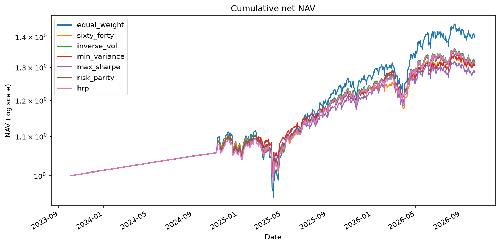
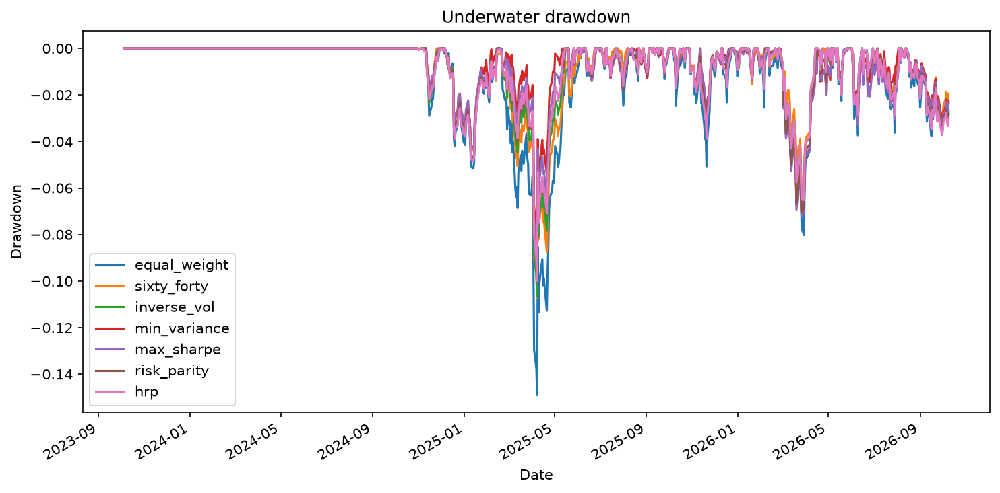

# QuantRisk results

## Executive summary

- The highest observed net Sharpe in this run was **equal_weight** at 0.847; the lowest was **max_sharpe** at 0.674.
- Across the VaR backtest rows, 16 Kupiec tests rejected nominal coverage; fhs had the highest Kupiec pass share.
- The most adverse illustrative shock in the saved table was **Equity crash** for equal_weight (-26.00%).
- The source panel has 5 assets and 4871 price rows; the saved backtest uses 5 assets from 2023-10-05 through 2026-10-09. See limitations below before interpreting performance.

## Data and universe

Adjusted ETF close data from Yahoo Finance with a Stooq fallback; simple returns, short-gap cleaning, and DuckDB persistence. The current saved data-quality table records 4871 observations from 2007-06-01 through 2026-10-09 with 0 missing prices.

## Methodology

See [methodology](../docs/methodology.md). The backtest is walk-forward with delayed close execution, daily weight drift, and turnover-based costs.

## Performance

| strategy | cagr | volatility | sharpe | max_drawdown | sortino | var_95 | cvar_95 |
| --- | --- | --- | --- | --- | --- | --- | --- |
| equal_weight | 0.1606 | 0.1414 | 0.8468 | -0.1490 | 1.2565 | 0.0130 | 0.0191 |
| sixty_forty | 0.1204 | 0.1050 | 0.7615 | -0.1072 | 1.1199 | 0.0095 | 0.0145 |
| inverse_vol | 0.1245 | 0.1092 | 0.7701 | -0.1067 | 1.1312 | 0.0099 | 0.0149 |
| min_variance | 0.1189 | 0.1000 | 0.7810 | -0.0860 | 1.1439 | 0.0089 | 0.0138 |
| max_sharpe | 0.1093 | 0.1036 | 0.6739 | -0.0916 | 0.9833 | 0.0096 | 0.0144 |
| risk_parity | 0.1212 | 0.1071 | 0.7558 | -0.1006 | 1.1065 | 0.0101 | 0.0147 |
| hrp | 0.1218 | 0.1072 | 0.7597 | -0.0999 | 1.1164 | 0.0101 | 0.0146 |

## Risk, drawdowns, and VaR

See `var_backtest_summary.csv` for formal coverage and independence tests. The observed pass share ranks fhs highest by Kupiec coverage; it is a descriptive ranking and does not establish universal model superiority.

## Stress results

Scenario P&L is `w · shock` and the hypothetical inputs are labeled as illustrative assumptions. The result table is in `stress_hypothetical.csv`.

## Statistical significance and sensitivity

Paired Sharpe comparisons and their explicit significance labels are in `sharpe_paired_tests.csv`. One-factor runs are in `sensitivity.csv` (70 rows); runs are cached by configuration hash.

## Limitations

- ETF universe chosen with hindsight and limited history
- Results are in-sample with respect to design choices
- Simplified cost model and no market impact
- Long-only 40% cap changes textbook unconstrained optimizer results
- Expected-return estimation error affects maximum Sharpe
- VaR models assume stable relationships within each estimation window
- Hypothetical shocks are illustrative assumptions, not forecasts

## Reproducibility

Run `make setup`, `make data`, `make backtest`, `make risk`, `make stress`, `make sensitivity`, and `make report`. The saved result files and configuration YAMLs are the source for numeric tables.
